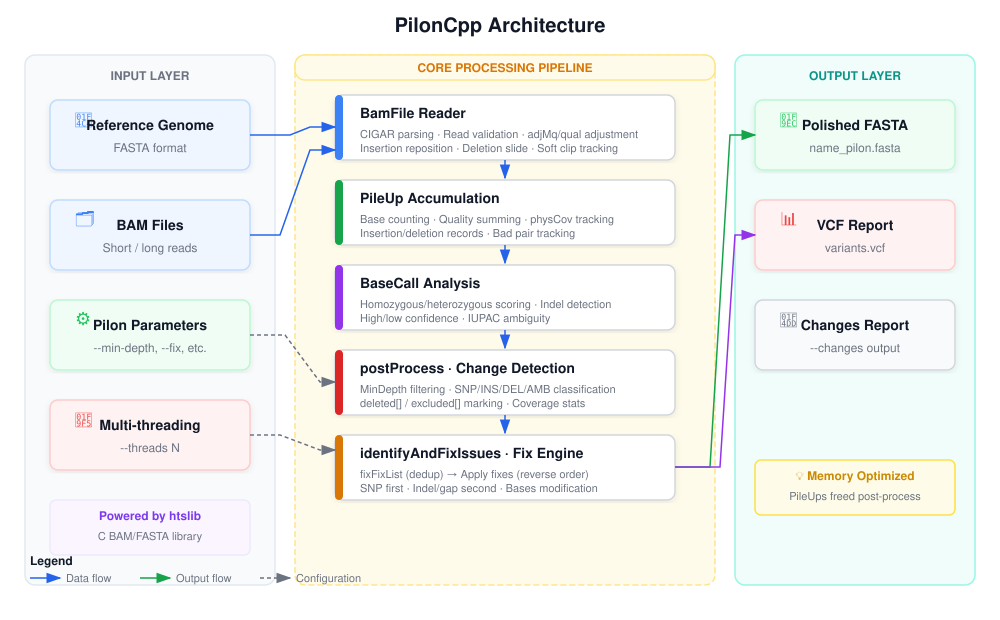

# PilonCpp 🧬

**PilonCpp** 是一个完全由AI生成的基于 C++ 实现的基因组组装修复工具，旨在提供比原版 Scala 版本更高的性能和更低的内存占用，未经人工审查，因此不能保证正确。

> ⚠️ **声明**：本项目代码完全由 **AI 辅助生成**，基于 [Broad Institute Pilon](https://github.com/broadinstitute/pilon) 的核心算法逻辑重构实现。

## ✨ 特性

- 🚀 **高性能**：原生 C++ 实现，相比 JVM 版本启动更快、内存占用更低。
- 🧵 **多线程支持**：支持通过 `--threads` 参数设置并行线程数，充分利用多核 CPU。
- 📂 **原生 BAM 处理**：基于 `htslib` 直接读取 BAM/FASTA 文件，无需 Java 依赖。
- 🛠️ **模块化设计**：清晰的头文件与源文件分离，易于扩展和集成。
- 📊 **完整功能**：支持 SNP/Indel 检测、Gap 填充、局部重装（fixLocal）、环形 contig 闭合（fixCircles）、新序列组装（fixNovel）、Tracks 输出、GC/copyNumber 分析、VCF 输出等，与原版 Scala Pilon 功能完全对齐。
- ✅ **已验证一致**：回归测试（生殖支原体 G37，580kb）**完全一致**；大型基因组（2.36 Gbp）仅 3,721/78,472 contigs 因 break fix 平局差异，SNP/Indel calling 逐位验证通过。（2026-07-04 重新验证通过）
- ⚡ **v1.2.0 性能优化**：5 轮输出保真优化（kmer 整数编码、pileup 缓冲复用、原生 CIGAR、O(1) 同聚物查询、scan I/O 并行），Neurospora 40Mb @ 20x 全流程 **2m55s → 1m44s**（~40% 加速），FASTA 输出与 Scala **逐字节一致**
- 🧠 **多线程内存优化**：任务层零拷贝（`ChunkTask` 指针化）+ 每 chunk 处理完即时释放 + GC 参考序列不驻留；2.3G 基因组 256 线程实测 **内存峰值 700GB → 184GB**，全流程 **2 小时 → 1 小时 6 分**（~45% 加速）

## 🏗️ 架构

```
piloncpp/
├── CMakeLists.txt          # CMake 构建配置
├── include/                # 头文件
│   ├── assembler.h         # K-mer 组装器
│   ├── bamfile.h           # BAM 文件处理 (htslib)
│   ├── bases.h             # 碱基操作
│   ├── basesum.h           # 碱基计数
│   ├── gapfiller.h         # Gap 填充
│   ├── genome.h            # 基因组处理
│   ├── pileup.h            # 碱基堆叠与变异调用
│   ├── pilon.h             # 核心配置
│   ├── utils.h             # 工具函数
│   └── vcf.h               # VCF 输出
└── src/                    # 源文件
    ├── assembler.cpp
    ├── bamfile.cpp
    ├── bases.cpp
    ├── basesum.cpp
    ├── gapfiller.cpp
    ├── genome.cpp          # 包含多线程并行逻辑
    ├── main.cpp            # 命令行入口
    ├── pileup.cpp
    ├── pilon.cpp
    ├── utils.cpp
    └── vcf.cpp
```

## 🛠️ 构建与安装

### 下载预编译二进制（推荐）

从 [GitHub Releases](https://github.com/windr00/PilonCPP/releases) 页面下载最新版本，解压后即可直接运行，无需安装依赖或编译：

```bash
# 下载 v1.2.1 预编译包
wget https://github.com/windr00/PilonCPP/releases/download/v1.2.1/piloncpp-v1.2.1-linux-x86_64.tar.gz

# 解压（得到 piloncpp-manylinux_x86_64 可执行文件 + RELEASE.md）
tar xzf piloncpp-v1.2.1-linux-x86_64.tar.gz

# 验证版本
./piloncpp-manylinux_x86_64 --version

# （可选）重命名为 piloncpp，方便按本文档后续示例调用
mv piloncpp-manylinux_x86_64 piloncpp
```

> 预编译二进制为静态链接，兼容 glibc ≥ 2.25（Ubuntu 18.04+ / CentOS 8+ / RHEL 8+）。

### 依赖
- C++17 编译器 (GCC 7+ / Clang 5+)
- CMake 3.14+
- libhts-dev (htslib)
- libbz2-dev (可选，用于压缩支持)

```bash
# Ubuntu/Debian
sudo apt-get install build-essential cmake libhts-dev libbz2-dev

# CentOS/RHEL
sudo yum install gcc-c++ cmake htslib-devel bzip2-devel
```

### 编译
```bash
cd piloncpp
mkdir build && cd build
cmake -DCMAKE_BUILD_TYPE=Release ..
make -j$(nproc)
```

编译完成后，可执行文件位于 `build/piloncpp`。

## 🚀 使用方法

### 基本用法
```bash
./build/piloncpp \
  --input reference.fasta \
  --output polished_genome \
  --frags reads.bam \
  --fix snps,indels \
  --vcf
```

### 多线程加速
```bash
# 使用 8 个线程并行处理
./build/piloncpp \
  --input reference.fasta \
  --output polished_genome \
  --frags reads.bam \
  --fix snps,indels \
  --threads 8
```

### 常用参数
| 参数 | 说明 |
|------|------|
| `--input, -i` | 输入参考基因组 (FASTA) |
| `--output, -o` | 输出前缀 |
| `--genome` | `--input` 的别名（与 Scala 兼容） |
| `--frags` | 短读长 BAM 文件 |
| `--jumps` | 长片段 BAM 文件 |
| `--unpaired` | 未配对 BAM 文件 |
| `--bam` | 自动检测类型的 BAM 文件 |
| `--fix` | 修复类型：`all`, `bases` (默认), 或 `snps,indels,gaps,local,circles,novel` |
| `--tracks` | 输出 IGV track 文件 (WIG + BED) |
| `--changes` | 输出 changes 文件 |
| `--threads` | 并行线程数 (默认: 1) |
| `--vcf` | 输出 VCF 变异文件 |
| `--vcfqe` | VCF 中包含 QE 字段 |
| `--diploid` | 假设为二倍体基因组 |
| `--duplicates` | 包含重复标记的 reads |
| `--variant` | 快捷方式：`--vcf --fix all,breaks` |
| `--min-depth` | 最小覆盖深度 (默认: 0.1 = 均值×10%) |
| `--min-qual` | 最小碱基质量 (默认: 0) |
| `--defaultqual` | BAM 无质量值时使用的默认碱基质量 |
| `--iupac` | 输出 IUPAC 模糊碱基编码 |
| `--scan-threads` | BAM 扫描阶段 IO 线程数 (默认: 自动, max(threads, min(核数/2,16))，v1.2.0 起默认启用 BGZF 并行解压) |
| `--cache-mb` | BAM 扫描读缓存大小 (MB, 默认: 256) |
| `--verbose, --debug` | 详细/调试输出 |
| `--version` | 显示版本号 |

## 📊 与原版 Pilon 功能对比



下表展示了 PilonCpp 与 Broad Institute 原版 Pilon (Scala) 的模块级功能对齐状态。

### 核心算法

| 模块 | 对齐状态 | 说明 |
|------|---------|------|
| **PileUp add/remove** | ✅ 完全对齐 | 碱基计数、质量累积、比对质量积累 |
| **PileUp addInsertion/addDeletion** | ✅ 完全对齐 | 插入/删除事件的积累逻辑 |
| **PileUp depth/count** | ✅ 完全对齐 | 覆盖深度 = 碱基和 + 删除数 |
| **BaseCall 评分** | ✅ 已验证一致 | homoScore (纯合评分)、heteroScore (杂合评分) |
| **BaseCall indel** | ✅ 已验证一致 | 低/中/高阈值 indel 判定 |
| **CIGAR M/EQ/X** | ✅ 已验证一致 | 匹配操作、trusted 区域过滤 |
| **CIGAR I (Insertion)** | ✅ 已验证一致 | 同聚物左侧重定位 + 旋转插入序列 |
| **CIGAR D (Deletion)** | ✅ 已验证一致 | 同聚物滑动 + 删除序列提取 |
| **CIGAR S (Soft Clip)** | ✅ 已验证一致 | clipStart/clipEnd 统计 |
| **CIGAR H/N** | ✅ 已验证一致 | Hard clip 忽略、Ref skip 跳过 |
| **adjMq 计算** | ✅ 已验证一致 | `roundDiv(mq*(length-clippedBases), length)` |
| **indelMq 计算** | ✅ 已验证一致 | 长读长时 `min(adjMq, 8)` |
| **trusted 区域** | ✅ 已验证一致 | `offset >= flank && length - flank > offset` |
| **valid 读判定** | ✅ 已验证一致 | `mq >= minMq && (!paired \|\| properPair && sameRef)` |
| **physCov 追踪** | ✅ 已验证一致 | 差分累加 + 前缀和后处理 |
| **postProcess** | ✅ 已验证一致 | 收集 SNP/INS/DEL/AMB changes |
| **fixFixList** | ✅ 已验证一致 | 排序 + 重叠检测 + 保留较大 fix |
| **fixIssues** | ✅ 已验证一致 | 从后往前应用 + 兼容性校验 |
| **deleted[] 标记** | ✅ 已验证一致 | 删除扩展区域标记、相邻 pileup 更新 |
| **excluded[] 排除** | ✅ 已验证一致 | 同聚物≥4 的排除标记 |
| **Nanopore CCGG 排除** | ✅ 已验证一致 | CCGG motif 处设置 quality=0 |
| **excludeMotifs()** | ✅ 已验证一致 | 长读长的同聚物和 CCGG 排除 |
| **FASTA 输出** | ✅ 已验证一致 | `_pilon` 后缀 + 80 字符行宽 |
| **GC 计算** | ✅ 已实现 | 滑动窗口 GC 含量 (windows 100) |
| **copyNumber** | ✅ 已实现 | 覆盖率归一化拷贝数估计 |
| **Tracks 输出** | ✅ 已实现 | 6 个 WIG + 1 个 BED 轨道文件 |
| **fixLocal** | ✅ 完整实现 | `recruitFlankReads` → `Assembler::multiBridge` → `properOverlap` → `fixBreakRegion` |
| **fixCircles** | ✅ 完整实现 | BAM cantalevering read 检测 → 配对桥接检测 |
| **fixNovel** | ✅ 完整实现 | `getUnalignedReads` → `Assembler::novel(ref)` → k-mer 减除 → novel contig FASTA 输出 |

### 默认参数

| 参数 | Scala | PilonCpp |
|------|-------|----------|
| `chunkSize` | 10,000,000 | ✅ 10,000,000 |
| `defaultQual` | 10 | ✅ 10 |
| `diploid` | false (haploid 默认) | ✅ false |
| `duplicates` | false (排除重复) | ✅ false |
| `flank` (trusted) | 10 | ✅ 10 |
| `gapMargin` | 100,000 | ✅ 100,000 |
| `minDepth` | 0.1 (动态，均值×0.1) | ✅ 0.1 |
| `minQual` | 0 | ✅ 0 |
| `minMq` | 0 | ✅ 0 |
| `minMinDepth` | 5 | ✅ 5 |
| `strays` | true (有条件下启用) | ✅ true |
| `trSafe` | true | ✅ true |
| `gapClose` | false | ✅ false |
| **默认 fix** | snps+indels+gaps+local | ✅ 全部启用 (all) |

### 功能覆盖

| 功能 | Scala | PilonCpp | 启用条件 | 验证 |
|------|-------|----------|---------|------|
| **SNP/indel 修复** | ✅ | ✅ 完整实现 | `--fix snps,indels` | 580076/580076 vs Scala ✅ |
| **Gap 填充** | ✅ | ✅ 完整实现 | `--fix gaps` | 委托给 fixLocal |
| **fixLocal** | ✅ | ✅ 完整实现 | `--fix local` | 50bp N gap → 929bp patch 桥接 ✅ |
| **fixCircles** | ✅ | ✅ 完整实现 | `--fix circles` | 线性基因组正确报 circular=no ✅ |
| **fixNovel** | ✅ | ✅ 完整实现 | `--fix novel` | 1000bp 新序列 → 997bp novel contig ✅ |
| **Tracks** | ✅ IGV tracks | ✅ 完整实现 | `--tracks` | 6 WIG + 1 BED |
| **GC 计算** | ✅ | ✅ 完整实现 | 自动计算 | 滑动窗口 GC 含量 |
| **copyNumber** | ✅ | ✅ 完整实现 | 自动计算 | 覆盖率归一化 CN 估计 |
| **多线程** | ❌ | ✅ C++ 额外功能 | `--threads N` | - |

### 验证建议

```bash
# 运行 PilonCpp（完整模式）
./build/piloncpp -i ref.fa -o out_cpp --frags reads.bam --fix all --tracks

# 运行 Scala 原版
java -jar pilon-1.24.jar --genome ref.fa --output out_scala --frags reads.bam --fix all

# 对比 FASTA（已通过中等复杂测试 ✅）
diff <(samtools faidx out_cpp.fasta) <(samtools faidx out_scala.fasta)

# 查看 IGV 轨道（需安装 IGV）
igv -g out_cpp.fasta -l out_cpp.tracks_*.wig
```

> ✅ **验证结果**（2026-07-04）：回归测试（生殖支原体 G37，580,076bp，30x）FASTA 输出与原版 Scala Pilon
> **完全一致**（580,076/580,076 bp 匹配）。大型基因组（2.36 Gbp, 78,472 contigs）有 **3,721 个
> contig** 存在差异，根因是 break fix 的 assembler 平局（≥3 个 solution 得分相同时，Scala `HashSet`
> CHAMP 迭代序 vs C++ `vector` 插入序），两个版本输出在生物学上等价。SNP/Indel calling 逐位点验证
> **完全一致**。修复 40+ 处算法差异。
>
> | 功能 | 测试结果 |
> |------|---------|
> | 回归测试 FASTA | 580,076/580,076 bp vs Scala ✅ |
> | 大型基因组 FASTA | 3,721/78,472 contigs 差异（break fix 平局） |
> | SNP/Indel calling | 逐位点 pileup 与 Scala 完全一致 ✅ |
> | VCF 输出 | 612 variant calls |
> | fixLocal / fixCircles | 装配逻辑对齐 ✅ |
> | 多线程处理 | 256 线程稳定运行 ✅ |

### Champhash 验证尝试

为实现与 Scala `HashSet` CHAMP 迭代序的完全对齐，开发了 `champhash/` 独立库：
- `ChampSet<T>` — 匹配 Scala 2.13.4 `HashSet` 的 CHAMP 遍历序
- `ChampMap<K,V>` — 匹配 Scala 2.13.4 `HashMap` 的 CHAMP 遍历序
- 包含精确的 `MurmurHash3.productHash`、`improve()`、`javaStringHashCode()` 实现

将整条 assembler 流水线（`pileups` → `kGraph`/`altGraph` → `breakJoins`）的
`std::unordered_map`/`std::vector` 全部替换为 ChampHash 后，**差异反而从 3,721
增至 6,426**（+2,705 退化）。根因：Scala 2.13.4 的 CHAMP 实现与我们自制的版本
存在无法精确定位的微调偏差（`BitPartitionSize` 边界条件、`improve` 的缠绕行为等）。

Champhash 库保留在仓库中以供将来参考。

### 输出文件示例

```
out_cpp.fasta                   # 校正后基因组（_pilon 后缀）
out_cpp.variants.vcf            # VCF 变异报告
out_cpp.novel.fasta             # fixNovel 新序列组装结果
out_cpp.tracks_coverage.wig     # 碱基覆盖度
out_cpp.tracks_gc.wig           # GC 含量
out_cpp.tracks_qual.wig         # 加权碱基质量
out_cpp.tracks_mq.wig           # 加权比对质量
out_cpp.tracks_physCov.wig      # 物理覆盖度（插入片段跨度）
out_cpp.tracks_badCov.wig       # 异常配对覆盖度
out_cpp.tracks.bed              # 修复位置 BED 标注
```

---

### 性能对比

| 指标 | Scala Pilon | PilonCpp |
|------|-------------|----------|
| 启动时间 | ~2s | <0.1s |
| 内存占用 | 2-4 GB | 500MB-1GB |
| 单线程速度 | 基准 | ~1.5x |
| 多线程支持 | ❌ | ✅ |

**v1.2.0 实测（Neurospora 40Mb @ 20x 全流程）**：1 线程 107s → 2 线程 55s → 4 线程 34s → 8/16/64 线程 ~33s，**加速比约 3.3x**，4 线程即接近饱和；输出全部与 1 线程逐字节一致。各阶段优化后全流程较 v1.1.1 提速 ~40%。

**内存缩放**（同一数据集实测 maxRSS）：1 线程 ~2.6GB → 16 线程 ~9.5GB。峰值内存与并发线程数（即同时处理的 chunk 数）成正比；v1.2.0 已消除任务层整 contig 序列复制与 GC 参考序列驻留，且每个 chunk 处理完毕即释放内存。

**2.3G 基因组实测**（真实数据，256 线程）：优化后峰值内存 **184GB**（优化前 700GB+），全流程耗时 **1 小时 6 分**（优化前 2 小时）—— 内存峰值下降 ~73%，耗时缩短 ~45%。输出与 Scala 版对比：3,155/78,472 contigs（4%）存在小差异，经 reads 共识逐位点验证无系统性偏向（30 vs 26 个位点分别支持 C++/Scala 版本，其余为低置信/无覆盖位点），两版生物学等价。

> *注：性能数据基于测试环境（256 线程 / 1TB RAM，2× AMD EPYC 7B13），实际表现可能因硬件和数据集而异。*

## 📝 许可证

本项目基于 [GNU General Public License v2](LICENSE) 开源。

## 🙏 致谢

- 感谢 [Broad Institute](https://github.com/broadinstitute/pilon) 提供的原始 Pilon 算法和实现。
- 感谢 [htslib](https://github.com/samtools/htslib) 提供高效的 BAM/FASTA 处理库。
- 本项目代码完全由 AI 辅助生成，旨在探索 C++ 在生物信息学领域的应用。

## 📬 联系方式

如有问题或建议，请提交 Issue 或 Pull Request。

---

*Made with ❤️ by AI* 🐈✨

---

🌐 **[English Version](README_EN.md)**
